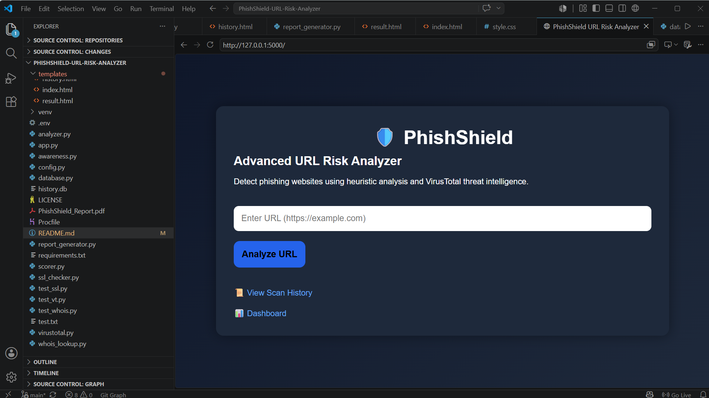
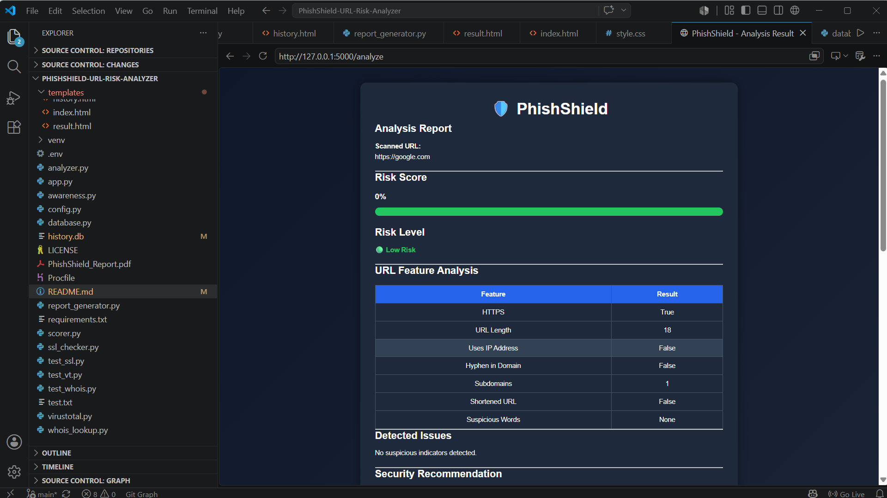
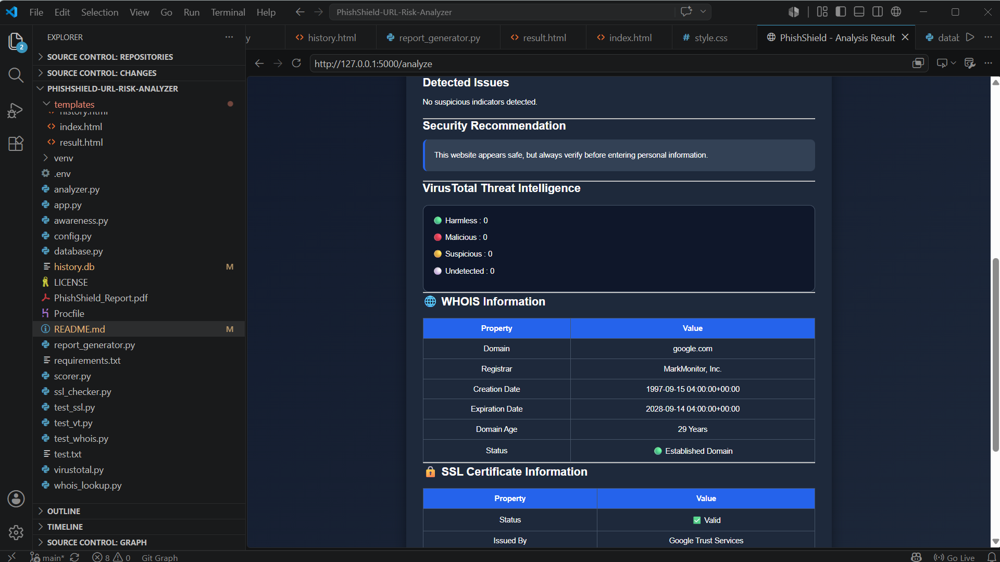
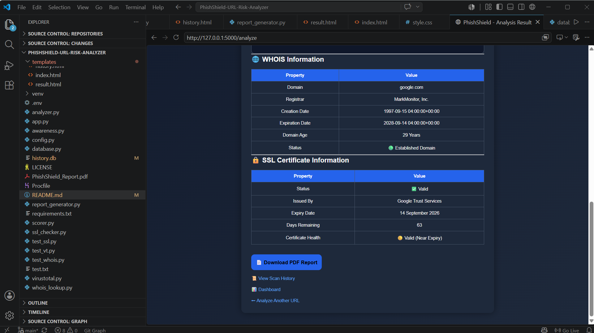
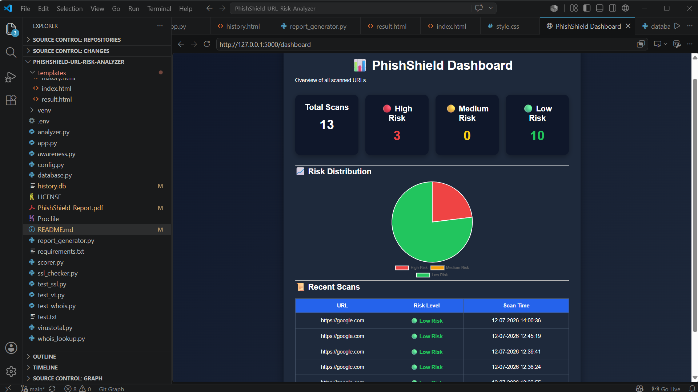
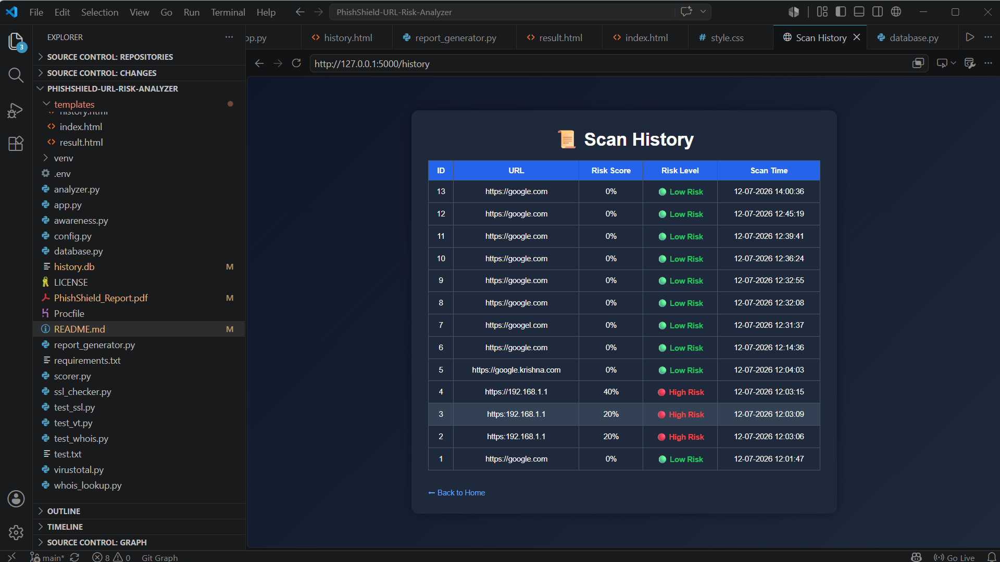
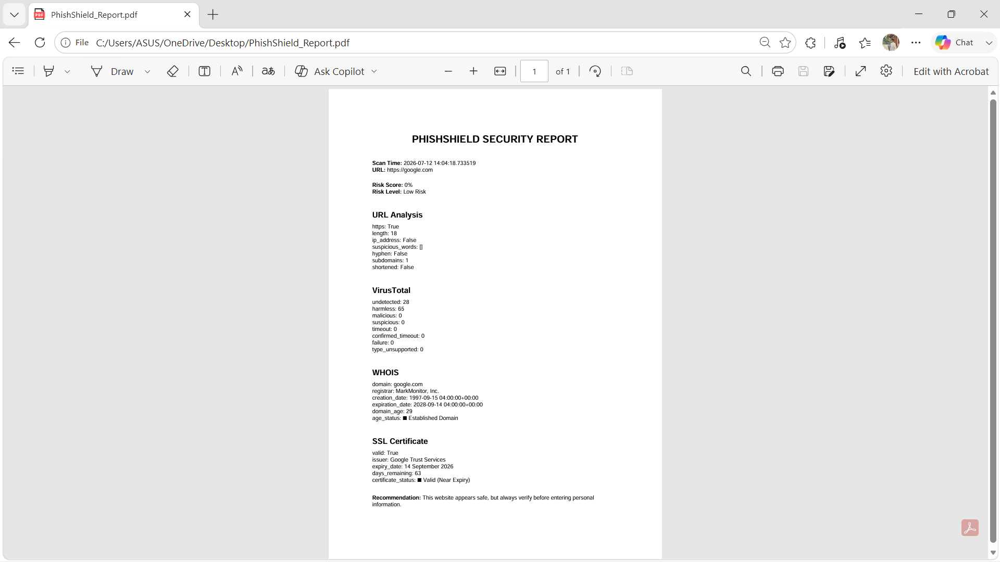

# 🛡️ PhishShield – URL Risk Analyzer

A Flask-based web application that analyzes website URLs for phishing indicators using heuristic analysis and external security services such as VirusTotal, WHOIS, and SSL certificate validation.

---

## 👨‍💻 Website Live Link


Website: https://krishnagupta.pythonanywhere.com/


---


## 📌 Features

- 🔍 URL Heuristic Analysis
- 📊 Risk Score Calculation
- 🦠 VirusTotal API Integration
- 🌐 WHOIS Domain Lookup
- 🔒 SSL Certificate Inspection
- 🗄️ SQLite Scan History
- 📈 Dashboard with Risk Analytics
- 📄 PDF Report Generation
- 🎨 Responsive User Interface

---

## 🛠️ Technologies Used

- Python
- Flask
- SQLite
- HTML5
- CSS3
- Chart.js
- Requests
- VirusTotal API
- ReportLab

---

## 📂 Project Structure

```text
PhishShield-URL-Risk-Analyzer/
│
├── app.py
├── analyzer.py
├── scorer.py
├── database.py
├── virustotal.py
├── whois_lookup.py
├── ssl_checker.py
├── report_generator.py
├── requirements.txt
├── README.md
│
├── static/
│   └── style.css
│
├── templates/
│   ├── index.html
│   ├── result.html
│   ├── history.html
│   └── dashboard.html
│
└── screenshots/
```

---

# 🚀 Installation

## 1. Clone the Repository

```bash
git clone https://github.com/Krishna-Gupta-Git/PhishShield-URL-Risk-Analyzer.git
```

## 2. Move into the Project Directory

```bash
cd PhishShield-URL-Risk-Analyzer
```

## 3. Install Required Packages

```bash
pip install -r requirements.txt
```

## 4. Configure VirusTotal API (Optional)

For security reasons, the VirusTotal API key is **not included** in this repository.

If you want VirusTotal scanning to work:

- Create your own free VirusTotal API key.
- Add it as an environment variable named:

```text
VT_API_KEY
```

If no API key is provided, the application will continue to work, but VirusTotal scan results will be unavailable.

## 5. Run the Application

```bash
python app.py
```

Open your browser and visit:

```text
http://127.0.0.1:5000
```

---

# 📷 Screenshots

## 🏠 Home Page



---

## 📄 Analysis Result 1



---

## 📄 Analysis Result 2



---

## 📄 Analysis Result 3



---

## 📊 Dashboard



---

## 📜 Scan History



---

## 📑 PDF Report



---

# 🔍 How It Works

1. User enters a website URL.
2. The application performs heuristic URL analysis.
3. A phishing risk score is calculated.
4. VirusTotal reputation is checked (if an API key is configured).
5. WHOIS information is retrieved.
6. SSL certificate details are verified.
7. Scan history is stored in SQLite.
8. A downloadable PDF report is generated.
9. Dashboard analytics are updated.

---

# 🚧 Future Improvements

- 🤖 Machine Learning-based phishing detection
- 📧 Email phishing scanner
- 🌍 Browser extension
- ☁️ Cloud deployment
- 👤 User authentication
- 📱 Mobile-friendly interface
- 📈 Real-time URL monitoring

---

# ⚠️ Disclaimer

This project is intended for **educational and learning purposes**. While it provides useful phishing indicators, it should not be considered a replacement for professional security tools.

---

# 👨‍💻 Author

**Krishna Gupta**

GitHub: https://github.com/Krishna-Gupta-Git

---

# ⭐ If you found this project useful, consider giving it a star on GitHub!
